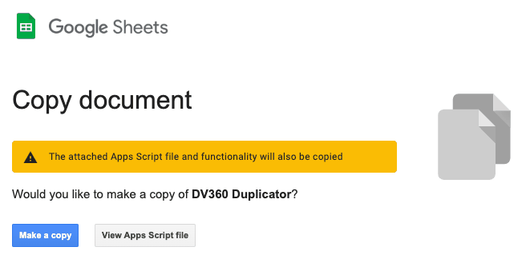
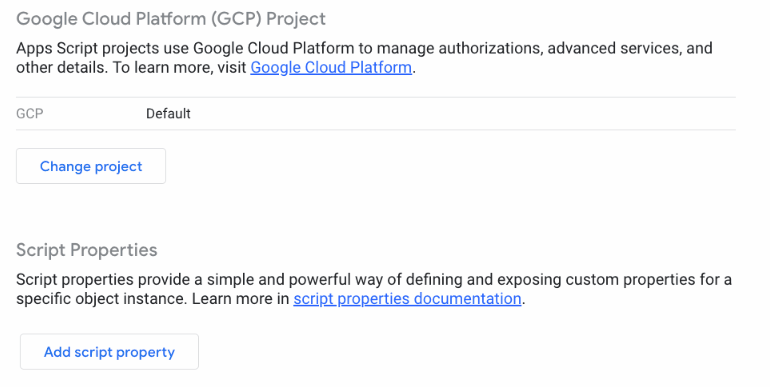
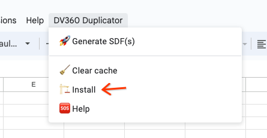

# DV360 Duplicator: Copy DV360 Campaigns Easy

Do you often need to replicate DV360 Campaigns, Line Items, YouTube Ads, etc. with small 
adjustments? Is it time consuming? Then this solution is for you.

"DV360 Duplicator" is a custom DV360 solution that allows to duplicate existing
marketing campaigns and adjust their settings in Google Sheets. Our solution
is based on [Apps Script](https://developers.google.com/apps-script) 
(we use [TypeScript](https://www.typescriptlang.org/)), 
[DV360 API](https://developers.google.com/display-video/api/reference/rest/v2), 
and [Structured Data Files](https://developers.google.com/display-video/api/structured-data-file/format).

**Note**: Currently DV360 API (v2) support's only a limited number of operations 
on the YouTube campaigns. Especially you can 
e.g. [list](https://developers.google.com/display-video/api/reference/rest/v2/advertisers.youtubeAdGroups/list) them, but you cannot create or modify those YouTube entities. That's why our
solution uses
[Structured Data Files](https://developers.google.com/display-video/api/structured-data-file/format)
instead (for create/modify operations).

**(!) Prerequisite**: In order to use this solution you need a **Google Cloud Project** 
with **enabled DV360 API**.

## Intro

Below you will find information on:
* How to install DV360 Duplicator.
* How to copy your DV360 campaigns fast (including partial copy, e.g. copy only YouTube Ads).
* Current limitations and caveats.

## How to install DV360 Duplicator

**Step 1**: Prepare your Google Cloud project:

Select existing GCP project or create a new one (you can find help
[here](https://cloud.google.com/resource-manager/docs/creating-managing-projects)
) and
[enable DV360 API](https://console.cloud.google.com/start/api?id=displayvideo.googleapis.com&credential=client_key) on that project.

**Step 2**: Copy [this spreadsheet](https://docs.google.com/spreadsheets/d/1b_ygTMwEwbfUe4yd-EU1sgSh6gZpjZgIaxaY-EQC3Mw/copy?usp=sharing):

**Step 3**: Connect your Google Cloud project to the copied Sheet 
(actually to the Apps Script project):
1. [Determine the **number** of your Cloud project](https://developers.google.com/apps-script/guides/cloud-platform-projects#determine_the_id_number_of_a_standard). This should be only digits.
1. In the copied spreadsheet open Apps Script from menu "Extensions > Apps Script"
 and then [switch the project](https://developers.google.com/apps-script/guides/cloud-platform-projects#switch_to_a_different_standard), by pasting your project 
 number to the "GCP project number" field

**Step 4**: Now you can go back to the sheet and install the solution by selecting 
menu "DV360 Duplicator > Install" and 
[authorizing](https://developers.google.com/apps-script/guides/services/authorization)
all required script permissions.

**Note**: Sometimes you need to reload the newly copied spreadsheet to view this menu.

## How to use DV360 Duplicator
